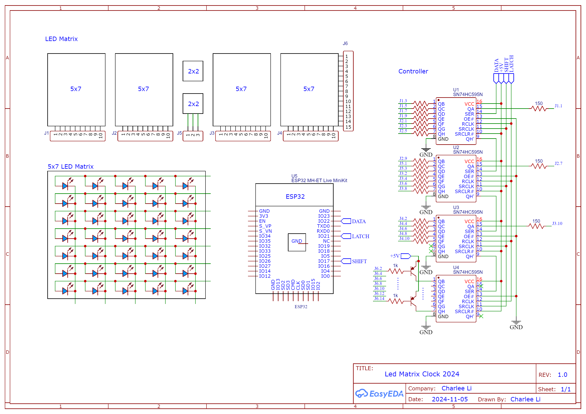

Led Matrix Clock 2024
=====================


## Hardware

This project is using the ESP32 MH-ET Live MiniKit board.

See [here](https://doc.riot-os.org/group__boards__esp32__mh-et-live-minikit.html) for the pin out of the board.


The hardware is a customized LED display with 3mm blue LEDs. The following diagram shows the layout (Q1..Q4 are the SN74HC595 chips).

```

  o o o o o   o o o o o         o o o o o   o o o o o | 2 \
  o o o o o   o o o o o   o o   o o o o o   o o o o o | 3  |
  o o o o o   o o o o o   o o   o o o o o   o o o o o | 4  |
  o o o o o   o o o o o         o o o o o   o o o o o | 5  | Q4
  o o o o o   o o o o o   o o   o o o o o   o o o o o | 6  |
  o o o o o   o o o o o   o o   o o o o o   o o o o o | 7  |
  o o o o o   o o o o o         o o o o o   o o o o o | 8 /
 -----------------------------------------------------+
  1 2 3 4 5   6 7 8 1 2   3 4   5 6 7 8 1   2 3 4 5 6
  `---------------' `-----------------' `-----------'
        Q1                  Q2                Q3

```


## Schematic




## Firmware

Install the [esp32 by Espressif Systems, 3.0.5](https://github.com/espressif/arduino-esp32) in the Board Manager of Arduino IDE.
Then choose the "MH ET LIVE ESP32MiniKit" board in the Tools menu.

Fill in the WiFi credentials in the `config.h` file.

The `TIME_SERVER` constant is a Web service that returns the current time in the ISO format `YYYY-MM-DDTHH:MM:SS.uuuuuuuuu+ZZ:ZZ`.


## 3D Printed Case

The case is designed in Autodesk Fusion and printed with a 3D printer.
See [stl](stl) folder for the STL files.


## Assembly

See [assembly](assembly) folder for the assembly instructions.

## Reference

- [ESP32 Timer API](https://docs.espressif.com/projects/arduino-esp32/en/latest/api/timer.html)
