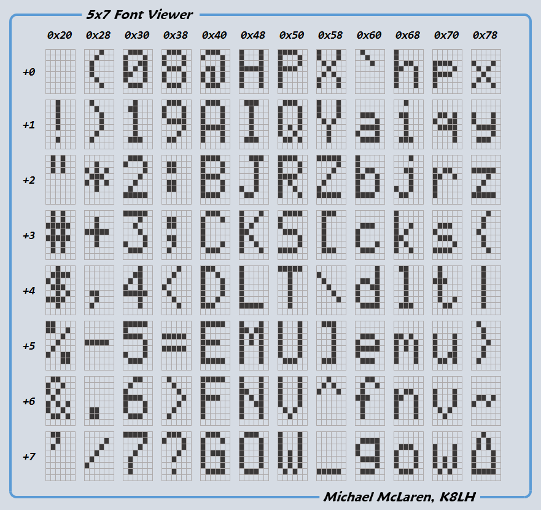

Assembly of the LED Matrix Clock
================================

I want to design a digital clock that:

- displays realistic numbers rather than using 7-seg numbers
- displays the time in a 24-hour format
- has a blinking colon to separate the hours and minutes
- is as small as possible
- looks like a commercial product
- auto WiFi time sync


The minimal font size is 5x7 pixels, which is commonly used in LCD 1602 displays.



In order to display the time in a 24-hour format, I need 2 digits for the hours and 2 digits for the minutes. The colon is two 2x2 pixel rectangle. That result in four 5x7 matricies and two 2x2 matricies. The layout can be done in the following way to minimize the number of LEDs to be soldered:

```

  o o o o o   o o o o o         o o o o o   o o o o o | 2 \
  o o o o o   o o o o o   o o   o o o o o   o o o o o | 3  |
  o o o o o   o o o o o   o o   o o o o o   o o o o o | 4  |
  o o o o o   o o o o o         o o o o o   o o o o o | 5  | Q4
  o o o o o   o o o o o   o o   o o o o o   o o o o o | 6  |
  o o o o o   o o o o o   o o   o o o o o   o o o o o | 7  |
  o o o o o   o o o o o         o o o o o   o o o o o | 8 /
 -----------------------------------------------------+
  1 2 3 4 5   6 7 8 1 2   3 4   5 6 7 8 1   2 3 4 5 6
  `---------------' `-----------------' `-----------'
        Q1                  Q2                Q3

```

In total this is a 22x7 LED matrix. I will use four SN74HC595 shift registers to control the LEDs, three for the columns and one for the rows.

The microcontroller is an ESP32 MH-ET Live MiniKit board ([pinout](https://doc.riot-os.org/group__boards__esp32__mh-et-live-minikit.html)). The board has a built-in WiFi module to enable WiFi time sync.

The circuit board is built on a 9x15cm perfboard, cutted into two equal pieces. Half of the board is used for the LED matrix and the other half for the SN74HC595 registers and ESP32 board. Two boards can be stacked so that all the invisible parts are hidden behind the LED matrix, to reduce the physical size of the clock.

The board is covered with electic tapes to reduce the glare on the metal pads.


Then the LEDs are soldered to the board. The LEDs are 3mm blue LEDs. The reason for choosing 3mm rather than 5mm is that 5mm LEDs will leave no space between the LEDs, so it will be impossible to separate the LEDs with a 3D printed grid.


The cathodes of the LEDs are connected vertically downwards, and the anodes are connected horizontally. Headers are soldered at the edges of the board to connect to the bottom board.


SN74HC595 registers, ESP32 board, and the necessary resistors and transistors are soldered to the bottom board.

The ESP32 board is soldered directly to the bottom board without using any headers.


More pictures of the two boards, and the final assembly:


Upload the firmware and try it out:


The case is designed in two parts.

The top part includes a grid to separate the LEDs. The grid is designed to be about 3mm taller than the LEDs to create a space between the front panel and the LEDs. This space will create diffused light.

The top part also includes four holes for the screws.

The bottom part has four through holes so that I can use long screws to hold the two parts together.

Also I need to make some cutouts for the USB port.

_Note: Initially I planned to use snap-fit to hold the two parts together, but a 3D-printed snap-fit is too fragile. Eventually I moved to screws.


Install the top board into the top part of the case. Due to some misalignment, I can only use three screws, but this is not a big problem.


Attach the bottom board to the top board.


Enclose the case with the bottom part. Long screws are used to hold the two parts together.


Power on and try it out. The grid blocked the refraction from other LEDs. The result looks good!


Now the final piece: a piece of acrylic glass, cutted to the size of the case, one side is sanded to diffuse the light.


Glue the acrylic glass to the top part of the case. The final result looks like a commercial product!


Final looks on the desk:


